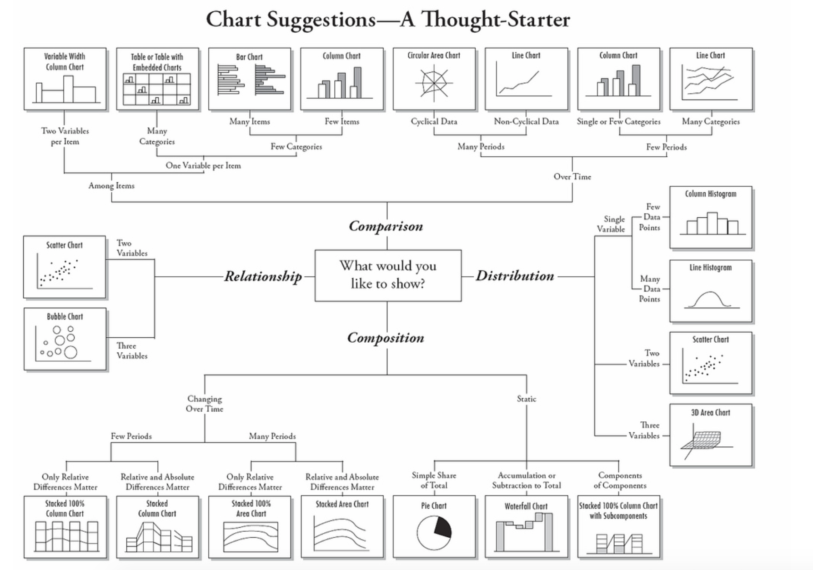
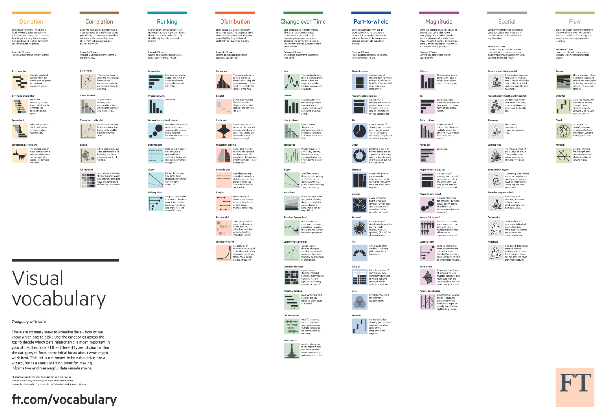
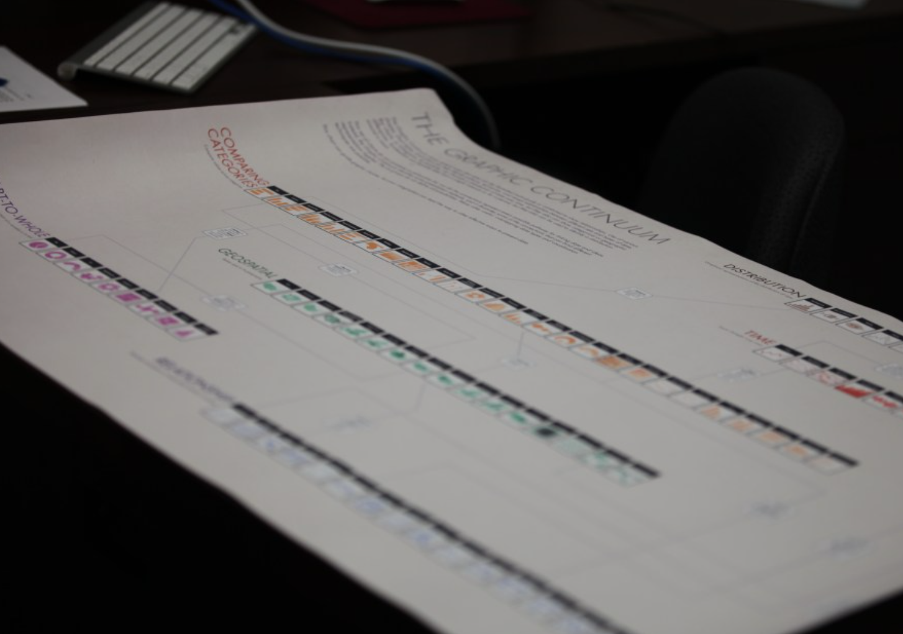

### Gráficos como guía para el análisis de datos

###### Chart Suggestion
Esquema creado por Andrew Abela

Fuente: [Andrew Abela](http://www.verstaresearch.com/blog/how-to-select-the-type-of-chart-to-use/)

Esquema en [.pdf](https://img.labnol.org/di/choosing_a_good_chart2.pdf)

###### Visual Vocabulary

Fuente: [FT](https://github.com/ft-interactive/chart-doctor/blob/master/visual-vocabulary/Visual-vocabulary.pdf)

Versión [interactiva](http://ft-interactive.github.io/visual-vocabulary/)

###### Graphic Continuum

Fuente: [Policy Viz](https://policyviz.com/2014/09/09/graphic-continuum/)

Versión de [gran resolución](https://s-media-cache-ak0.pinimg.com/originals/1c/e4/d7/1ce4d7999d15abc6276218672c71b702.jpg)

=================

###### Otros recursos:

* Una base de datos, [25 formas de verla](http://flowingdata.com/2017/01/24/one-dataset-visualized-25-ways/)

* The bad map we see every presidential election [Vox](https://www.youtube.com/watch?v=hlQE4IGFc5A)

* [Chart Chooser](http://labs.juiceanalytics.com/chartchooser/index.html)

* Esquema de [Tableau](http://www.tableau.com/sites/default/files/media/which_chart_v6_final_0.pdf)
