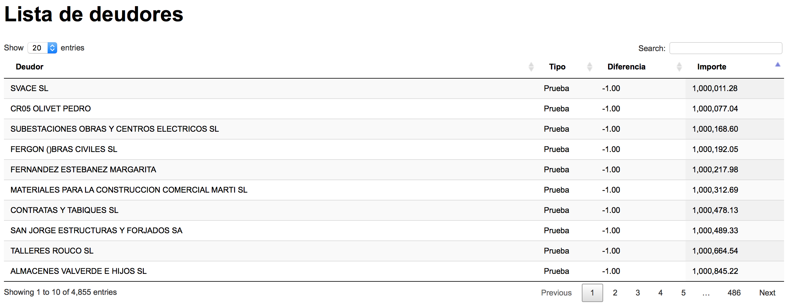

# Datatables

En ocasiones para analizar un conjunto de datos muy grande tenemos que trabajar con tablas que, de forma fluida, carguen esos datos. Una solución para ello es Datatables.

`
### ¿Qué es Datatables?

[Datatables](https://datatables.net) es un complemento de jQuery (librería de Javascript) que permite añadir funcionalidades avanzadas a cualquier tabla HTML. Entre éstas funciones destacan el filtrado, la ordenacioón y la edición de datos
`

Aquí está el código de Datatables, que mezcla HTML, CSS y Javascript, con el que vamos a trabajar:

[https://github.com/adrianblanco/data-mining/tree/master/datatables](https://github.com/adrianblanco/data-mining/tree/master/datatables)

Veamos a ver paso a paso en el código HTML comentado cómo hemos construido la tabla.

Para visualizar la tabla y trabajar con los datos en nuestro navegador, vamos a montar un servidor con [Python](https://www.python.org). Por tanto, primero tenemos que tener instalado Python en nuestro ordenador. Si no está instalado, podéis decargarlo de [aquí](https://www.python.org/downloads/windows/)   Para ello, abrimos la línea de comandos (Shell en Windows o Terminal en Mac).

Una vez instalado, desde la consola, vamos a la carpeta donde tenemos alojado el código que hemos descargado mediante el comando `cd`. Una vez dentro, ejecutamos el siguiente comando, en función de qué versión de Python tenemos instalada.

Para Python 2:

`python -m SimpleHTTPServer 8000`

En cambio, si tenemos instalado Python 3, escribimos:

`python -m http.server 8000`

Una vez instalado, vamos a la siguiente url `http://localhost:8000` donde aparecerá la tabla.

