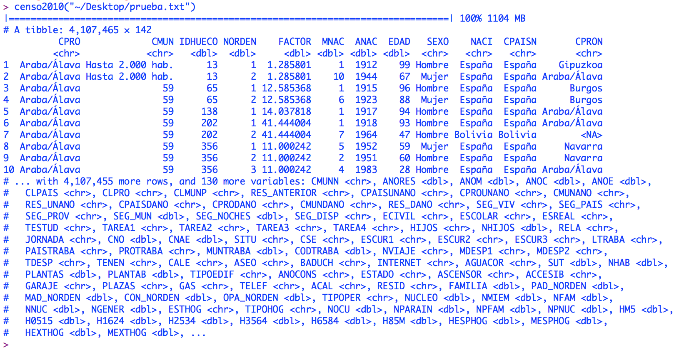

Lo primero instalamos el paquete MicroDatosEs para trabajar con los microdatos del INE. [Aquí](http://www.ine.es/prodyser/microdatos.htm) tenéis el listado de datos disponibles.

`install.packages("MicroDatosEs")`

¿Qué es MicroDatosEs?

Es un paquete de R desarrollado por el matemático Carlos Gil Bellosta que permite leer de forma sencilla los microdatos de varias publicaciones del INE con facilidad para posteriormente realizar un completo análisis de los datos de los mismos.

En este [enlace](https://cran.r-project.org/web/packages/MicroDatosEs/index.html) está la información de refencia de MicroDatosEs, así como ejemplos, manual de referencia.

Cargamos la librería:

`library(MicroDatosEs)`

Es posible que cargue automáticamente el paquete `readr` u os pida instalarlo.

Recordad, a partir de ahora cuando tengamos dudas sobre las características del paquete, escribimos en R:

`?MicroDatosEs`

Una vez tengamos la librería cargada, vamos a la web del INE para descargar el paquete de MicroDatos en el que estamos interesados.

Como primer paso, vamos a seleccionar el conjunto de datos del último censo. Lo descargamos y lo cargamos en R.

En Mac, escribimos algo así:

`censo2010("~/Desktop/nombredelarchivo.txt")`

En Windows:

`censo2010("c:/Users/USUARIO/Desktop/nombredelarchivo.txt")`

La carga de datos tardará unos segundos. R nos devolverá el siguiente mensaje:

Ahora ya podemos comenzar el análisis de los datos.
