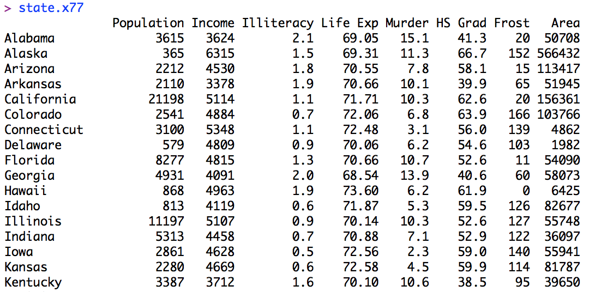
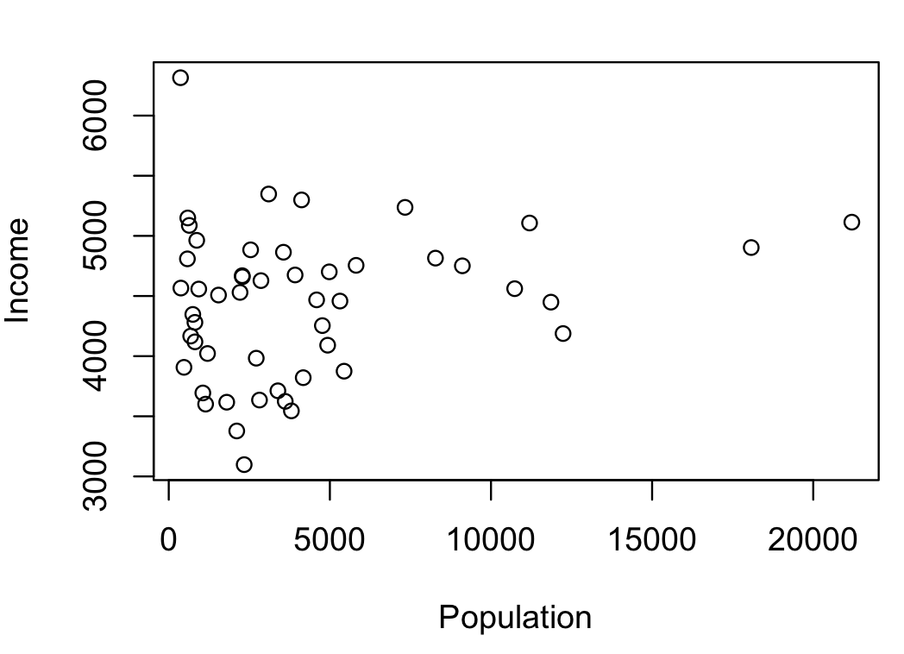

# Iniciación a R

Master de Periodismo de datos

Universidad de Villanueva

## ¿Qué es R?

“R es un lenguaje y un entorno de programación para el desarrollo de operaciones estadísticas y visualizaciones"

## Primeros pasos en R

R se compone de una consola en la que introduciremos las órdenes para analizar, transformar y visualizar datos.

Para trabajar con una interfaz más sencilla podemos instalar [R Studio](https://www.rstudio.com/products/rstudio/download/)

R forma parte de un proyecto colaborativo y abierto. Sus usuarios pueden publicar paquetes que extienden su configuración básica. Para trabajar con estos paquetes que extienden las opciones que ofrece R, tenemos que instalarlos. Para ello, introducimos en la consola.

`install.packages(" _nombredelpaquete_ ")`

Una vez instalado, tenemos que cargar el paquete o librería previamente a utilizar sus funcionalidades. Escribimos en la consola:

`library( _nombredelpaquete_ )`

En R, la ayuda de una función (summary en el ejemplo siguiente), se consulta así:

`?_función_`
`help( _nombredelpaquete_ )`

Si usas RStudio, el texto de la ayuda correspondiente a esa función aparecerá en la pestaña correspondiente del panel inferior derecho.

La ayuda de una función en R siempre tiene la misma estructura:

* descripción de la función
* argumentos que admite,
* detalle del funcionamiento de la función y de sus argumentos,
* ejemplos.

## Primeras funciones de data analysis o data mining

Por defecto R contiene una serie de datasets o conjuntos de datos preinstalados. Durante estos primeros pasos, vamos a trabajar con ellos.

Para ver una lista de los diferentes conjuntos de datos preinstalados escribe en la consola:

`data()`

Este input hará que R abra un documento llamado "R data sets". En él hay una lista con los diferentes conjuntos de datos disponibles.

En este tutorial trabajaremos con el conjunto de datos denominado 'state' que contiene información de los 50 estados que forman Estados Unidos.

US State Facts and Figures

En concreto, escribiremos en la consola

`state.x77`

o lo que es lo mismo:

`print(state.x77)`



Ambos inputs nos devuelven la tabla completa con los datos demográficos de los diferentes estados de EEUU que vamos a trabajar.

Para inspeccionar una tabla utilizaremos una serie de funciones básicas que se usan muy frecuentemente en R.

Por ejemplo, para tener unas primeras nociones de qué datos contiene la tabla y hacer un primer análisis visual, podemos visualizar sus datos de forma rápida sencilla. Para ello, utilizamos la función `plot()`.

`plot(state.x77)`



De momento la visualiación (scatter plot) no nos dice. ¿Y si queremos sustituir cada uno de los puntos por las iniciales de cada estado? De esta forma, podremos extraer las primeras conclusiones:

```
plot(state.x77)
text(state.x77,state.abb)
```

También podemos crear algo más avanzado (es solo un ejemplo, nada de 😥😱):

```
plot(as.integer(state.region), state.x77[,1], ylab='Population',
	xlab='Region',xlim=c(1,4.75), xaxt='n')
axis(1, at=1:4, lab=levels(state.region) )

text( as.integer(state.region)+.5, state.x77[,1], state.abb )
segments( as.integer(state.region)+0.025, state.x77[,1],
		as.integer(state.region)+.375, state.x77[,1] )       
```

Además, una función muy útil para tener una primera impresión de los datos es `summary()`. Ésta nos ofrece un resumen estadístico muy útil de las diferentes variables o columnas que conforman la tabla.

`summary(state.x77)`    

En concreto nos ofrece las siguientes operaciones estadísticas:

Cuando los conjuntos de datos contienen cientos o miles de datos, no es operativo ver la tabla completa como hemos hecho antes con print().

En estos casos, podemos utilizar la función head para visualizar las seis primeras filas de la tabla que estamos analizando.

`head(state.x77)`  

Si por defecto el número de filas que nos muestra no es suficiente, hay solución:

`head(state.x77, n=30)`

Con la variable ´n´ indicamos el número de filas que queremos mostrar. Ésta nos permite una visión más completa que la disponible por defecto y manejable a su vez.

Por otro lado, si queremos ver las últimas filas de la tabla, utilizaremos la función `tail`.

`tail(state.x77)`

Si queremos conocer el número de filas y columnas, escribimos:

`dim(state.x77)`     

 Además también podemos conocer de forma rápida el número de filas que tiene la tabla que estamos analizando.

`nrow(state.x77)`

 Para conocer el número de columnas, en cambio, utilizamos la siguiente función:

`ncol(state.x77)`

En caso de desconocer de qué variables se compone la columna, podemos conocer sus nombres con `colnames()`

`colnames(state.x77)`  


===========

> Ejercicio

>Realiza las operaciones anteriores sustituyendo la base de datos de los diferentes estados de EEUU 'state.x77' por iris, una de las bases de datos más utilizadas en R para iniciarse.

* ¿Cuántas columnas tiene?
* ¿Cuál es el nombre de las diferentes variables que se compone?
* ¿Podríais darme un resumen estadístico de la tabla?

===========


Si recordáis antes hemos visualizado de forma rápida y sencilla los datos de state.x77 con la función plot(). Lo que hemos hecho es mostrar los datos en un scatterplot o gráfico de dispersión. ¿Para qué son útiles este tipo de gráficos en el análisis de datos?

En primer lugar, nos ayudan a ver tendencias y patrones, así como a identificar los outliers o valores atípicos de un conjunto de datos. Veámoslo en un ejemplo práctico en el siguiente [vídeo](https://www.youtube.com/watch?v=jbkSRLYSojo).
